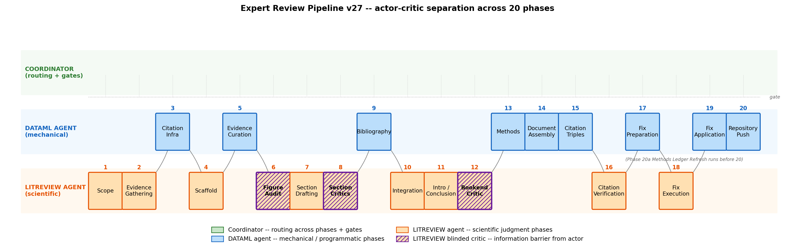

# Computational Review Template

Template repository for producing comprehensive AI-assisted critical literature reviews using the Expert Review Pipeline v27.

## Pipeline Overview



The pipeline executes 20 phases with **actor-critic separation** — section writers cannot see how they will be critiqued, figure auditors cannot see the argument arc, and citation verifiers cannot see the fix protocol. This prevents agents from gaming evaluation criteria.

## Quick Start

1. **Create a new repo** from this template (Use this template → Create a new repository)
2. **Clone the new repo** and update `myst.yml` with your review title and description
3. **Open in Claude** and provide your review prompt:

```
Start a comprehensive critical literature review titled: "[YOUR TITLE]"

The three files in skills/ define the complete pipeline:

skills/comprev-orchestrator-v27.md — The coordinator protocol. Read this FIRST.
It defines the routing across 20 phases, gate artifacts, and the session protocol.
Per-phase rules live in the agent skills, which the coordinator loads on demand.

skills/comprev-reviewer-agent.md — The worker skill for LITREVIEW agents.
Pass this to every LITREVIEW delegation so the agent can load it.

skills/comprev-figure-construction.md — Already published as a skill on LITREVIEW agents.
Section writers load it for figure production.

GitHub Repository: https://github.com/[YOUR-ORG]/[YOUR-REPO]
Push all outputs to this repo in Phase 20.

Evidence parameters: [OPTIONAL — omit for defaults]
- Target ≥200 papers per cluster, snowball 2 rounds
- Saturation criterion: <2% new unique in last 100
- Total bibliography target: ≥1000

Table of Contents:
1. Introduction
2. [Your Section 2]
3. [Your Section 3]
...
N. Conclusion
```

4. The pipeline populates `content/`, `evidence/`, `figures/`, and `provenance/`
5. GitHub Actions auto-builds and deploys the MyST site to GitHub Pages

## What's Included

### Skills (19 files in `skills/`)

The pipeline is split into role-specific skills with **information barriers** to enforce actor-critic separation. Worker skills produce content; validator skills run after each phase as blinded gates that emit named pass/fail checks into the gate JSON.

**Worker skills (13):**

| Skill | Phase | Role | Barrier |
|-------|-------|------|---------|
| `comprev-orchestrator-v27` | All | Coordinator | Sees everything |
| `comprev-scoping` | 1 | LITREVIEW | No barriers (first phase, sees user prompt) |
| `comprev-evidence-gathering` | 2 | LITREVIEW | Cannot see critic/writing criteria |
| `comprev-scaffold` | 4 | LITREVIEW | Cannot see critic criteria |
| `comprev-figure-audit` | 6 | LITREVIEW | Blinded — no scaffold or argument arc |
| `comprev-section-writing` | 7 | LITREVIEW | Cannot see critic criteria |
| `comprev-critic` | 8, 12 | LITREVIEW | Blinded — no scaffold or writing template |
| `comprev-integration` | 10–11 | LITREVIEW | Full visibility (integration role) |
| `comprev-verification` | 15–17 | LITREVIEW | Cannot see fix protocol |
| `comprev-fix-execution` | 18 | LITREVIEW | Cannot see verification criteria |
| `comprev-dataml-phases` | 1, 3, 5, 9, 13–15, 17, 19–20 | DATAML | No barriers (mechanical work) |
| `comprev-reviewer-agent` | 2, 4, 6–8, 10–12, 16, 18 | LITREVIEW | Evidence & writing procedures |
| `comprev-figure-construction` | 7 | LITREVIEW | Figure production |

**Validator skills (6):**

| Skill | Phase | Role | What it gates |
|-------|-------|------|---------------|
| `comprev-scoping-validator` | 1V | DATAML | Scope JSON, evidence-parameters consistency, plan structure, prompt-verbatim provenance |
| `comprev-evidence-validator` | 2V, 5V | DATAML | Evidence-package schema, per-cluster coverage, fulltext rate |
| `comprev-curation-validator` | 5V | DATAML | Per-section evidence package size, conflict and figure-data presence |
| `comprev-citation-validator` | 9V | DATAML | BibTeX entry well-formedness, DOI resolution, key uniqueness |
| `comprev-triples-validator` | 15V | DATAML | One triple per `{cite:p}`/`{cite:t}` occurrence, no sampling |
| `comprev-myst-validator` | 7V, 14V, 19V, 20V | DATAML | MyST build, structural checks, figure/heading consistency, plugin-directive invocation, evidence-package population |

### Plugins (3 files in `plugins/`)

| Plugin | What it does |
|--------|-------------|
| `authorship-plugin.mjs` | Renders interactive CRediT authorship widget |
| `evidence-explorer-plugin.mjs` | Loads evidence packages into interactive browser |
| `figure-lightbox-plugin.mjs` | Click-to-zoom lightbox for inline figures |

### Content placeholders (`content/`)

Pre-configured pages that the pipeline populates:
- `00_frontmatter.md` — Abstract + authorship explorer
- `01_introduction.md` — Placeholder (written in Phase 11)
- `Methods.md` — Methods template with pipeline figure
- `evidence_database.md` — Interactive evidence explorer
- `provenance.md` — Pipeline execution summary

### Site infrastructure

- `myst.yml` — MyST configuration with top-bar navigation (Review | Methods | Evidence | Provenance | GitHub)
- `.github/workflows/deploy.yml` — Auto-builds MyST site and deploys to GitHub Pages
- `scripts/shared_style.py` — Common figure style (colors, fonts, 300 DPI)
- `content/authors.yml` — Author metadata for the authorship widget (extended into `myst.yml`)

## Pipeline Architecture

**Act 1 — Evidence & Infrastructure** (Phases 1–6): Define scope, gather evidence from literature databases (PubMed, OpenAlex, bioRxiv), build citation infrastructure from CrossRef, construct the review scaffold, curate per-section evidence packages, and audit figure comparisons for methodological validity.

**Act 2 — Drafting & Criticism** (Phases 7–13): Draft sections in parallel (max 4 agents), run blinded 6-track criticism, build bibliography from CrossRef, perform 6-pass integration for consistency, write introduction/conclusion/abstract, run blinded bookend critic on intro/conclusion, and generate the methods section.

**Act 3 — Assembly, Verification & Deploy** (Phases 14–20): Assemble the complete document, exhaustively extract citation triples (every citation occurrence), verify ALL citations with full-text-first claim checking (DOI resolution, title/author/metadata match, full-text claim verification with supporting passage audit trail), prepare and execute fixes for non-verified citations, apply fixes, and push to GitHub.

### Evidence Parameters

The pipeline's evidence-gathering depth is user-configurable via the prompt. Phase 1 extracts these from your review request:

| Parameter | Default | What it controls |
|-----------|---------|-----------------|
| `min_papers_per_cluster` | 70 | Minimum unique papers per topic cluster |
| `saturation_criterion` | null | Optional stopping rule (e.g., "<2% new unique in last 100") |
| `snowball_rounds` | 0 | Citation-chasing rounds via OpenAlex (forward + backward) |
| `total_bibliography_target` | null | Optional floor for total bibliography across all clusters |

**Saturation mode:** Say "saturate the literature" in your prompt — the pipeline sets `min_papers_per_cluster: null`, `saturation_criterion: "<2% new unique in last 100"`, `snowball_rounds: 2`, and searches until the field is exhausted.

**Quota mode:** Say "≥200 papers per section" — the pipeline gathers at least 200 per cluster via keyword search without snowballing.

**Both:** Specify a floor AND a saturation criterion — the agent must meet the floor AND confirm saturation.

Phase 5 curation floors scale proportionally with your evidence density target.

### Key Design Principles

- **Mechanical citation infrastructure**: All citation keys and author names come from CrossRef API — never from LLM memory. This prevents hallucinated references.
- **Actor-critic separation**: Writers don't know how critics will evaluate them. Critics don't know the intended argument. This prevents gaming.
- **Incremental artifact saves**: Agents save intermediate work before expensive operations. If an agent crashes, partial work survives.
- **Max 4 parallel agents**: Prevents system resource exhaustion from too many simultaneous heavy agents.
- **Gate checkpoints**: Each phase transition requires a named gate artifact. The coordinator verifies compliance before advancing.
- **Full-text citation verification**: Every citation-claim pair is verified against the cited paper's full text (not just abstract). VERIFIED status requires a verbatim supporting passage from the paper. This catches interpretive mismatches where the abstract is topically compatible but the paper's findings contradict the review's claim.

## Customization

- **Title and metadata**: Edit `myst.yml` project title, description, and keywords
- **Authors**: Edit `content/authors.yml` to add human contributors alongside the AI author
- **Figure style**: Edit `scripts/shared_style.py` to change colors, fonts, and figure aesthetics
- **Navigation**: The top bar (Review | Methods | Evidence | Provenance | GitHub) is configured in `myst.yml` site.nav

## License

MIT
