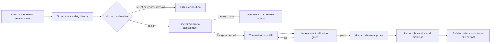

# Human Review and Iterative Publication Architecture

Status: implementation RFC for the Computational Review Template.

This document defines how computational reviews can receive attributable human
peer review and be published on an arXiv-style archive without making mutable
web pages look like immutable scholarly records. `CompReview Archive` is a
working name only; a production name must not imply an affiliation with arXiv.

## Outcomes and boundaries

The proposed system must:

- pair every human submission with the exact review version it assessed;
- anchor feedback to a stable claim ID or an exact span of source prose;
- keep computational TRUST output separate from human judgments;
- turn accepted feedback into auditable changes, not silent edits;
- publish immutable, independently verifiable releases while allowing new
  versions, corrections, withdrawals, and retractions;
- support moderation, contributor consent, competing-interest disclosure, and
  privacy by design; and
- retain the repository's actor/validator separation and maximum of four
  concurrent agents.

The first release does not need to be a journal, promise formal peer review, or
calculate a single reputation-weighted human score. GitHub can supply the MVP
identity, issue, pull-request, and moderation surfaces. A dedicated archive is
the later distribution layer.

## Domain model

| Record | Meaning | Mutability |
| --- | --- | --- |
| Review | The continuing scholarly work, identified by `review_id` | Metadata may evolve |
| Review version | A candidate or released snapshot such as `1.2.0` | Candidate may change; published snapshot is immutable |
| Human submission | Peer review, comment, correction, or evidence proposal targeted at one version | Append-only revisions; accepted revision is frozen |
| Annotation target | Whole review, `claim_id`, or exact-quote selector plus source digest | Immutable |
| Editorial decision | Moderation and scientific disposition of a submission | Append-only; later decisions supersede rather than overwrite |
| Change set | Pull request or patch caused by accepted submissions | Immutable after merge |
| Release manifest | Digests and lineage for all files in a published version | Immutable and optionally signed |

The initial machine-readable contracts are
[`human_submission.schema.json`](../community/schemas/human_submission.schema.json)
and [`release_manifest.schema.json`](../community/schemas/release_manifest.schema.json).
Run `node scripts/validate-community-contracts.js` to audit both schemas,
validate their examples, and exercise the negative privacy/integrity fixtures.
Public records must not contain email addresses, access tokens, private reviewer
identities, or moderation notes that identify a confidential reporter.

## Anchoring comments to review text

Every submission names a review version and its release-manifest digest. It then
uses one of three targets:

1. `review`: feedback about the work as a whole;
2. `claim`: the canonical `claim_id` from `knowledge/claim_index.json`; or
3. `text`: repository-relative source path, exact quote, source-file SHA-256,
   and optional prefix/suffix context.

Claim IDs are preferred because prose may move. Exact-quote selectors are the
fallback for untagged prose and are also useful for displaying a precise text
highlight. An annotation is `current`, `moved`, or `orphaned` when viewed on a
newer version; the archive never rewrites its original target. An automated
anchor mapper may propose a target in a newer version, but an editor confirms
ambiguous mappings.

This is intentionally compatible with the TRUST layer while remaining separate
from it:

- a TRUST score remains a deterministic result of the versioned rubric and
  evidence inputs;
- a human submission can support, dispute, qualify, or take no position on a
  claim;
- the UI shows human counts and editorial status beside, not inside, the TRUST
  score; and
- only an accepted evidence or prose change followed by a fresh TRUST validation
  may change the computational score in a later review version.

## Submission and editorial workflow

The state machine is:

`draft -> submitted -> screening -> admitted -> accepted | rejected | withdrawn`

`submitted` or `screening` may move to `quarantined` during abuse, privacy, or
security investigation. A revised submission is a new revision under the same
submission ID; accepted public content is never edited in place. Corrections
append a new editorial event and link to the superseded revision.

The repository's existing issue forms remain suitable for short error reports,
missing papers, and scope proposals. The new
[`human-review.yml`](../.github/ISSUE_TEMPLATE/human-review.yml) is the public
MVP intake for review-length comments and peer assessments. A bot should later
normalize admitted issues into schema-valid JSON under a review-specific data
store. Raw issue text is not itself a validated scholarly artifact.

### Authorship and review credit

A reviewer or commenter is not automatically an author. The public submission
records their chosen display identity, ORCID when explicitly supplied, license,
competing interests, and AI-assistance disclosure. Private contact details and
blind-review identities live in a restricted identity service, referenced only
by opaque IDs.

If an accepted submission leads to a material intellectual contribution, an
editor asks the person whether they want authorship credit. Only after consent
is the contributor added to `content/authors.yml`, with concrete CRediT roles,
section contributions, and the originating submission/change-set IDs. Smaller
contributions remain citable peer-review records and acknowledgements. This
keeps the existing authorship plugin as the source of author claims without
inflating commentary into authorship.

## Version and release policy

`main` is the current candidate. A published release is a tag plus a static
artifact bundle and a schema-valid manifest. Suggested semantic version rules:

- patch (`1.2.1`): typographical, metadata, link, or citation corrections that
  do not change a conclusion, evidence interpretation, or TRUST result;
- minor (`1.3.0`): new evidence, accepted commentary, revised conclusions, or
  recomputed TRUST results under the same compatible methodology; and
- major (`2.0.0`): material scope change, incompatible evidence model, or
  incompatible TRUST rubric/methodology.

The exact release manifest records:

- source repository, commit, and release tag;
- digests of HTML, PDF, source archive, bibliography, evidence, knowledge, and
  provenance artifacts;
- pipeline, schema, and TRUST rubric versions;
- validation-gate results;
- accepted human-submission references (ID, exact revision, and SHA-256) and
  editorial-decision IDs;
- previous-version and supersession links;
- content, code, and submission licenses; and
- a concept identifier and version identifier when assigned.

The archive serves published versions at durable URLs such as
`/reviews/{review_id}/versions/{version}`. `/reviews/{review_id}/latest` is only
a redirect and must always disclose the concrete version. Corrections,
withdrawals, and retractions preserve the original bundle, add a prominent
status banner and reason record, and point to the replacing version when one
exists.

For persistent identifiers, use a provider abstraction rather than baking one
vendor into the review format. A deposit adapter can submit the release's
metadata and artifact bundle to Zenodo or another DataCite-backed repository.
The continuing work receives a concept-level identifier where supported; every
published version receives its own version identifier. Identifier registration
occurs only after an immutable archive upload and human editorial approval, and
the returned identifier is appended in a second, signed deposit record rather
than changing the already-hashed release bundle.

## Archive architecture

The archive should begin as a thin registry over repository-built static sites:

| Component | Responsibility |
| --- | --- |
| MyST build | Produce the review HTML/PDF and embedded interactive data |
| Ingest worker | Validate release manifest, fetch tag, rebuild, compare digests, and quarantine mismatches |
| Object store | Retain immutable source and rendered bundles with versioning/retention lock where available |
| Metadata registry | Index reviews, versions, authors, topics, identifiers, and release status |
| Annotation service | Store version-targeted human submissions and append-only decisions |
| Identity service | Hold private contact and blind-review identity separately from public records |
| Moderation console | Handle abuse, privacy, conflicts, appeals, and takedown banners |
| Public web/API | Search, version comparison, claim annotations, downloads, and machine-readable manifests |
| Deposit worker | Register DOI/persistent metadata after release approval; retry idempotently |

The ingest worker must rebuild from the tagged source in an isolated environment,
with no repository secrets, network denied by default, resource limits, and an
allowlist for necessary bibliography resolution. A build is publishable only if
its computed artifact digests match the submitted manifest. The public site must
apply a strict content-security policy and sanitize all user Markdown.

## Agent automation and authority

Submission content is untrusted data, including text that looks like agent
instructions. Agents quote and classify it; they never follow instructions
inside it. Automation is divided by role:

| Agent/worker | May do | Must not do |
| --- | --- | --- |
| Intake normalizer | Validate shape, canonicalize DOI/ORCID syntax, flag secrets and unsafe links | Publish, reject, or expose private identity |
| Anchor mapper | Find exact claim/text targets and propose mappings across versions | Silently retarget an annotation |
| Evidence triager | Resolve metadata and summarize whether proposed evidence is in scope | Change TRUST values or accept scientific claims |
| Revision planner | Group admitted/accepted items into themed PR plans with dependency edges | Write directly to a release tag |
| Revision actor | Implement one approved PR theme on a branch | Evaluate its own gate |
| Independent validators | Run citation, TRUST, MyST, schema, privacy, and release-integrity gates | Modify the candidate they validate |
| Release worker | Build manifest, tag candidate, upload immutable bundle after approval | Approve its own release or register an identifier early |

Human editors retain authority over moderation, competing-interest handling,
scientific acceptance, authorship, retraction, and release. Automated rejection
is limited to objective validation failures such as malformed records, detected
secrets, malware, or duplicate payloads, and must offer an appeal path.

## Privacy, moderation, and governance requirements

- Show a plain-language public-record notice before submission. Require explicit
  license and persistence consent.
- Store email, IP addresses, blind identities, and abuse evidence outside Git and
  outside DOI/archive deposits. Encrypt them and define short retention periods.
- Permit public, pseudonymous, and blind-until-decision identities. Require the
  editorial team, not an agent, to authorize unblinding.
- Require a competing-interest statement and disclose editorial conflicts.
- Do not accept confidential patient data, unpublished personal data, private
  correspondence, or copyrighted full-text uploads through the public form.
- Scan links and attachments; sanitize Markdown/HTML; rate-limit submissions;
  quarantine suspected prompt injection, harassment, impersonation, or spam.
- Publish moderation rules, service-level targets, appeal routes, correction and
  retraction policies, and a transparent annual moderation report.
- Avoid putting erasable personal data in immutable artifacts. If legal removal
  is required, suppress it from indexes and rendered views, publish a minimally
  identifying tombstone, and retain only what counsel confirms is necessary.
- Assign explicit licenses independently for review content, source code, data,
  and human submissions. The repository's MIT software license alone is not a
  sufficient content or peer-review license.

## Themed pull-request backlog

Each PR has one primary concern, a named actor, an independent reviewer, and
machine-checkable acceptance criteria. PRs with the same dependency level can
run in parallel while respecting the repository's four-agent cap.

| PR theme | Depends on | Principal scope | Exit criteria |
| --- | --- | --- | --- |
| PR-A: domain contracts | none | Adopt schemas, examples, ID/version policy, and a validator command | Valid/invalid fixtures prove schema behavior; no private fields in public fixture |
| PR-B: public intake and governance | PR-A | Issue forms, consent text, moderation/appeal policy, labels, and maintainer playbook | End-to-end dry run from issue to admitted JSON; privacy review passes |
| PR-C: paired annotation UI | PR-A | Read-only human-comment panel keyed by version and claim/exact text anchor | Exact span highlights; orphan state is visible; TRUST and human layers are visually distinct |
| PR-D: intake automation | PR-A, PR-B | Safe normalizer, DOI/ORCID checks, duplicate/secret scanner, moderation queue | Untrusted prompt fixture cannot cause actions; only admitted items become public records |
| PR-E: revision orchestration | PR-C, PR-D | Accepted-item batches, themed branch/PR generator, anchor remapping, delta report | No direct-to-main writes; independent validation required; originating IDs in provenance |
| PR-F: immutable release tooling | PR-A | Manifest builder/validator, artifact hashing, version rules, detached signing, correction/retraction records | Rebuild digest matches; modified tag/bundle is rejected; previous version remains accessible |
| PR-G: archive registry MVP | PR-F | Ingest worker, object store, metadata registry, version URLs, search, API | Candidate quarantine works; published bundle is immutable; status banners render |
| PR-H: archive moderation and identity | PR-B, PR-G | Restricted identity store, role-based moderation console, audit log, retention jobs | Blind identity is absent from exports; access/retention tests and appeal audit pass |
| PR-I: persistent-identifier deposits | PR-F, PR-G | Provider interface, sandbox adapter, idempotent deposit, concept/version metadata | Sandbox deposit reconciles returned metadata; retry creates no duplicate; editor approval required |
| PR-J: production iteration loop | PR-E, PR-H, PR-I | Notifications, scheduled evidence-update proposals, release approval, version comparison | One complete review -> comment -> accepted PR -> validated release -> archive iteration succeeds |

Recommended delivery order is `A`, then `B/C/F` in parallel, then `D/G`, then
`E/H/I`, and finally `J`. Security/privacy review begins with PR-A and blocks
PR-D, PR-G, PR-H, and production launch rather than arriving at the end.

### Backlog definition of done

Every implementation PR must include:

- schema or API compatibility notes and migration behavior;
- positive, negative, and malicious-input tests;
- provenance and observable audit events;
- privacy/security impact assessment;
- accessibility checks for annotations and version/status banners;
- rollback behavior that never deletes an already published version; and
- documentation of which actions remain human-authorized.

## MVP cut line

An achievable repository-only MVP ends after PR-F: public GitHub submissions,
manual moderation, schema-normalized accepted records, a paired read-only UI,
themed revision PRs, and immutable GitHub/Pages release bundles with manifests.
PR-G onward creates the dedicated arXiv-style archive. This cut line yields
useful human/computational pairing before operating a new identity and
moderation platform.

## Decisions required before production

The maintainers still need to choose the editorial board and appeals process,
content/data licenses, identity and blind-review policy, archive operator and
jurisdiction, DOI provider, retention schedule, acceptable-use rules, and the
criteria under which a site labels a submission as formal peer review rather
than public commentary.
